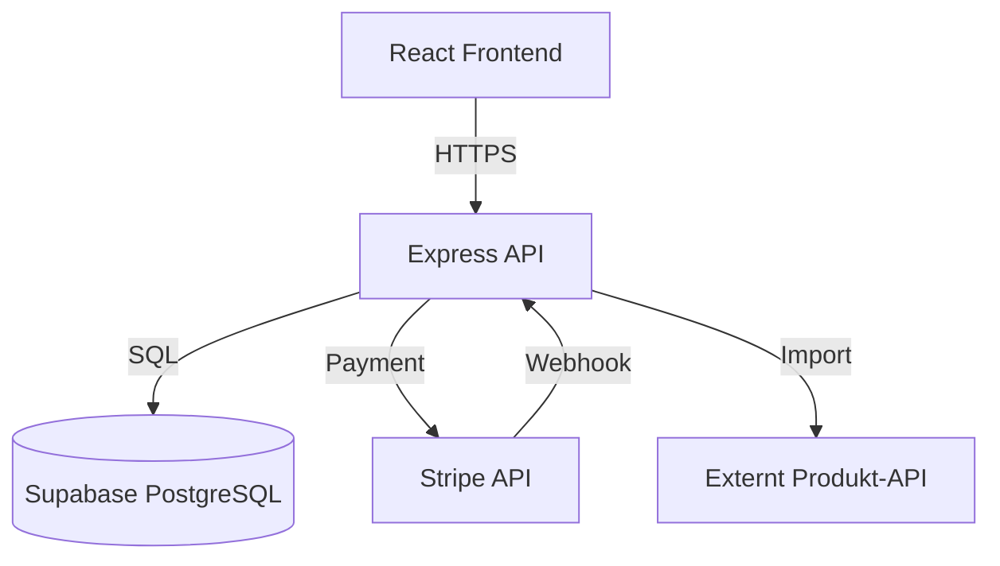

# Designdokument – Professionell E-handelsplattform

## Översikt

E-handelsplattformen är en fullstack-applikation byggd med modern webbteknologi. Systemet består av en React-baserad frontend, en Node.js/Express backend-API, PostgreSQL-databas via Supabase, och Stripe för betalningar. Arkitekturen följer en tydlig separation mellan presentation, affärslogik och dataskikt.

### Teknisk stack

**Frontend:**
- React 18+ med TypeScript
- Next.js 14+ för SSR/SSG och routing
- Tailwind CSS för styling
- React Query för datahantering
- Zustand för global state (varukorg)

**Backend:**
- Node.js 20+ med Express
- TypeScript
- Supabase Client för databasåtkomst
- Stripe SDK för betalningar
- JWT för autentisering

**Databas:**
- PostgreSQL via Supabase
- Row Level Security (RLS) för säkerhet

**Infrastruktur:**
- Vercel för frontend hosting
- Supabase för databas och auth
- Stripe för betalningar

## Arkitektur

### Systemöversikt



### Lagerseparation

**Presentation Layer (Frontend):**
- React-komponenter för UI
- Pages för routing
- Hooks för affärslogik
- Context/State för global data

**API Layer (Backend):**
- REST endpoints
- Middleware för auth och validering
- Controllers för request handling
- Services för affärslogik

**Data Layer:**
- Repository pattern för databasåtkomst
- Models för datastrukturer
- Migrations för schema

## Komponenter och gränssnitt

### Frontend-komponenter

#### Layout-komponenter
```typescript
// Header.tsx
interface HeaderProps {
  user: User | null;
  cartItemCount: number;
}

// Footer.tsx
interface FooterProps {
  // Statisk footer med länkar och betalningsikoner
}

// Layout.tsx
interface LayoutProps {
  children: React.ReactNode;
}
```

#### Produktkomponenter
```typescript
// ProductCard.tsx
interface ProductCardProps {
  product: Product;
  onAddToCart: (productId: string) => void;
}

// ProductDetail.tsx
interface ProductDetailProps {
  productId: string;
}

// ProductList.tsx
interface ProductListProps {
  products: Product[];
  loading: boolean;
}
```

#### Varukorg-komponenter
```typescript
// Cart.tsx
interface CartProps {
  items: CartItem[];
  onUpdateQuantity: (itemId: string, quantity: number) => void;
  onRemove: (itemId: string) => void;
}

// CartItem.tsx
interface CartItemProps {
  item: CartItem;
  onUpdateQuantity: (quantity: number) => void;
  onRemove: () => void;
}
```

#### Checkout-komponenter
```typescript
// Checkout.tsx
interface CheckoutProps {
  cartItems: CartItem[];
  totalAmount: number;
}

// PaymentForm.tsx
interface PaymentFormProps {
  amount: number;
  onSuccess: (orderId: string) => void;
  onError: (error: string) => void;
}
```

#### Admin-komponenter
```typescript
// AdminProductList.tsx
interface AdminProductListProps {
  products: Product[];
  onEdit: (product: Product) => void;
  onDelete: (productId: string) => void;
}

// ProductForm.tsx
interface ProductFormProps {
  product?: Product;
  onSubmit: (data: ProductFormData) => Promise<void>;
}

// OrderList.tsx
interface OrderListProps {
  orders: Order[];
  onUpdateStatus: (orderId: string, status: OrderStatus) => void;
}

// APIKeyManager.tsx
interface APIKeyManagerProps {
  onSave: (apiKey: string) => Promise<void>;
  onImport: () => Promise<void>;
}
```

### Backend API-endpoints

#### Autentisering
```
POST   /api/auth/register
POST   /api/auth/login
POST   /api/auth/logout
GET    /api/auth/me
```

#### Produkter (Publika)
```
GET    /api/products
GET    /api/products/:id
```

#### Produkter (Admin)
```
POST   /api/admin/products
PUT    /api/admin/products/:id
DELETE /api/admin/products/:id
POST   /api/admin/products/import
```

#### Varukorg
```
GET    /api/cart
POST   /api/cart/items
PUT    /api/cart/items/:id
DELETE /api/cart/items/:id
```

#### Betalning
```
POST   /api/checkout/create-payment-intent
POST   /api/webhooks/stripe
```

#### Ordrar
```
GET    /api/orders
GET    /api/orders/:id
GET    /api/admin/orders
PUT    /api/admin/orders/:id/status
```

#### API-nycklar (Admin)
```
POST   /api/admin/api-keys
GET    /api/admin/api-keys
```

### API Request/Response-format

#### Produkter
```typescript
// GET /api/products
Response: {
  products: Product[];
  total: number;
  page: number;
  pageSize: number;
}

// POST /api/admin/products
Request: {
  name: string;
  description: string;
  price: number;
  image: string;
  stock: number;
}
Response: {
  product: Product;
}
```

#### Checkout
```typescript
// POST /api/checkout/create-payment-intent
Request: {
  cartItems: CartItem[];
  paymentMethod: 'card' | 'paypal' | 'klarna';
}
Response: {
  clientSecret: string;
  orderId: string;
}
```

## Datamodeller

### Databasschema

```sql
-- Users table
CREATE TABLE users (
  id UUID PRIMARY KEY DEFAULT uuid_generate_v4(),
  email VARCHAR(255) UNIQUE NOT NULL,
  password_hash VARCHAR(255) NOT NULL,
  role VARCHAR(20) NOT NULL DEFAULT 'customer',
  created_at TIMESTAMP DEFAULT NOW(),
  updated_at TIMESTAMP DEFAULT NOW()
);

-- Products table
CREATE TABLE products (
  id UUID PRIMARY KEY DEFAULT uuid_generate_v4(),
  name VARCHAR(255) NOT NULL,
  description TEXT,
  price DECIMAL(10, 2) NOT NULL,
  image VARCHAR(500),
  stock INTEGER NOT NULL DEFAULT 0,
  active BOOLEAN DEFAULT TRUE,
  created_at TIMESTAMP DEFAULT NOW(),
  updated_at TIMESTAMP DEFAULT NOW()
);

-- Orders table
CREATE TABLE orders (
  id UUID PRIMARY KEY DEFAULT uuid_generate_v4(),
  user_id UUID REFERENCES users(id),
  total_price DECIMAL(10, 2) NOT NULL,
  status VARCHAR(50) NOT NULL DEFAULT 'pending',
  stripe_payment_intent_id VARCHAR(255),
  created_at TIMESTAMP DEFAULT NOW(),
  updated_at TIMESTAMP DEFAULT NOW()
);

-- Order items table
CREATE TABLE order_items (
  id UUID PRIMARY KEY DEFAULT uuid_generate_v4(),
  order_id UUID REFERENCES orders(id) ON DELETE CASCADE,
  product_id UUID REFERENCES products(id),
  quantity INTEGER NOT NULL,
  price_at_purchase DECIMAL(10, 2) NOT NULL,
  created_at TIMESTAMP DEFAULT NOW()
);

-- API keys table (encrypted)
CREATE TABLE api_keys (
  id UUID PRIMARY KEY DEFAULT uuid_generate_v4(),
  name VARCHAR(255) NOT NULL,
  encrypted_key TEXT NOT NULL,
  created_by UUID REFERENCES users(id),
  created_at TIMESTAMP DEFAULT NOW(),
  last_used_at TIMESTAMP
);

-- Cart table (optional, kan också vara session-baserad)
CREATE TABLE cart_items (
  id UUID PRIMARY KEY DEFAULT uuid_generate_v4(),
  user_id UUID REFERENCES users(id),
  session_id VARCHAR(255),
  product_id UUID REFERENCES products(id),
  quantity INTEGER NOT NULL,
  created_at TIMESTAMP DEFAULT NOW(),
  updated_at TIMESTAMP DEFAULT NOW()
);
```

### TypeScript-modeller

```typescript
// User model
interface User {
  id: string;
  email: string;
  role: 'customer' | 'admin';
  createdAt: Date;
  updatedAt: Date;
}

// Product model
interface Product {
  id: string;
  name: string;
  description: string;
  price: number;
  image: string;
  stock: number;
  active: boolean;
  createdAt: Date;
  updatedAt: Date;
}

// Order model
interface Order {
  id: string;
  userId: string;
  totalPrice: number;
  status: OrderStatus;
  stripePaymentIntentId?: string;
  items: OrderItem[];
  createdAt: Date;
  updatedAt: Date;
}

type OrderStatus = 'pending' | 'paid' | 'shipped' | 'delivered' | 'cancelled';

// Order item model
interface OrderItem {
  id: string;
  orderId: string;
  productId: string;
  product?: Product;
  quantity: number;
  priceAtPurchase: number;
  createdAt: Date;
}

// Cart item model
interface CartItem {
  id: string;
  productId: string;
  product: Product;
  quantity: number;
  createdAt: Date;
  updatedAt: Date;
}

// API key model
interface APIKey {
  id: string;
  name: string;
  encryptedKey: string;
  createdBy: string;
  createdAt: Date;
  lastUsedAt?: Date;
}
```

## Korrekthetsegenskaper

*En egenskap är en karakteristik eller beteende som ska gälla för alla giltiga exekveringar av ett system - i grund och botten ett formellt påstående om vad systemet ska göra. Egenskaper fungerar som bryggan mellan läsbara specifikationer och maskinverifierbara korrekthetsgarantier.*


### Property Reflection

Efter att ha analyserat alla acceptanskriterier identifierar jag följande redundanser och konsolideringsmöjligheter:

1. **Varukorg-egenskaper**: Egenskaperna 2.3 (uppdatera totalsumma) och 2.4 (ta bort och uppdatera totalsumma) kan konsolideras till en enda egenskap om varukorgsinvarianter
2. **Produktvisning**: Egenskaperna 1.2 (produktsida visar alla fält) och 7.4 (admin listar produkter) testar liknande rendering - kan konsolideras
3. **Ordervisning**: Egenskaperna 5.1 (kundvy av ordrar) och 8.1 (adminvy av ordrar) testar liknande listfunktionalitet
4. **Autentisering**: Egenskaperna 3.3 (lyckad inloggning) och 3.4 (misslyckad inloggning) kan kombineras till en egenskap om autentiseringsbeteende
5. **Validering**: Flera valideringsegenskaper (7.5 för pris, 8.4 för orderstatus) kan grupperas under en generell valideringsegenskap

Efter reflektion behåller jag de mest värdefulla egenskaperna som ger unik valideringsnytta.

### Korrekthetsegenskaper

**Property 1: Produktrendering innehåller alla obligatoriska fält**
*För alla* produkter, när en produktsida renderas, ska renderingen innehålla produktnamn, beskrivning, pris, bild och lagerstatus
**Validerar: Krav 1.2**

**Property 2: Lägg till i varukorg ökar antal**
*För alla* produkter och varukorgar, när en produkt läggs till i varukorgen, ska antalet produkter i varukorgen öka med ett
**Validerar: Krav 2.1**

**Property 3: Varukorgsinvariant - totalsumma är alltid korrekt**
*För alla* varukorgar, totalsumman ska alltid vara lika med summan av (pris × antal) för alla produkter i varukorgen, oavsett om produkter läggs till, tas bort eller antal ändras
**Validerar: Krav 2.3, 2.4**

**Property 4: Varukorg persisterar under session**
*För alla* varukorgar, om en produkt läggs till i varukorgen, ska produkten finnas kvar i varukorgen under hela sessionen
**Validerar: Krav 2.5**

**Property 5: Registrering skapar konto**
*För alla* giltiga email-adresser och lösenord (minst 8 tecken), när en kund registrerar sig, ska ett nytt konto skapas i databasen
**Validerar: Krav 3.1**

**Property 6: Lösenordsvalidering**
*För alla* lösenord, om lösenordet har färre än 8 tecken ska registreringen avvisas, och om lösenordet har 8 eller fler tecken ska det accepteras
**Validerar: Krav 3.2**

**Property 7: Autentiseringsbeteende**
*För alla* inloggningsförsök, om uppgifterna är korrekta ska en session skapas, och om uppgifterna är felaktiga ska åtkomst nekas
**Validerar: Krav 3.3, 3.4**

**Property 8: Lösenord lagras aldrig i klartext**
*För alla* användare i databasen, lösenordsfältet ska vara hashat och inte matcha det ursprungliga lösenordet
**Validerar: Krav 3.5**

**Property 9: Stripe-branding exponeras inte**
*För alla* renderingar av kassasidan, ska texten "Stripe" inte förekomma i det synliga användargränssnittet
**Validerar: Krav 4.2**

**Property 10: Webhook skapar order**
*För alla* lyckade betalningar, när Stripe skickar en webhook med status "succeeded", ska en order skapas med status "paid"
**Validerar: Krav 4.4**

**Property 11: Misslyckad betalning behåller varukorg**
*För alla* misslyckade betalningar, varukorgen ska förbli oförändrad efter betalningsförsöket
**Validerar: Krav 4.5**

**Property 12: Ordernummer är unika**
*För alla* ordrar i systemet, ska varje order ha ett unikt ordernummer
**Validerar: Krav 5.3**

**Property 13: Ordrar persisterar**
*För alla* skapade ordrar, ska ordern finnas kvar i databasen även efter systemomstart
**Validerar: Krav 5.4**

**Property 14: Admin-auktorisering**
*För alla* användare, endast användare med rollen "admin" ska få åtkomst till adminpanel-endpoints
**Validerar: Krav 6.1, 6.2**

**Property 15: Admin-endpoints kräver autentisering**
*För alla* admin-endpoints, ska oautentiserade requests nekas med 401-status
**Validerar: Krav 6.3**

**Property 16: Produktskapande lagrar alla fält**
*För alla* nya produkter, när en admin skapar en produkt, ska produkten lagras i databasen med alla angivna fält (namn, beskrivning, pris, bild, lagerstatus)
**Validerar: Krav 7.1**

**Property 17: Produktuppdatering sparar ändringar**
*För alla* produkter, när en admin redigerar en produkt, ska ändringarna reflekteras i databasen
**Validerar: Krav 7.2**

**Property 18: Produktborttagning inaktiverar produkt**
*För alla* produkter, när en admin tar bort en produkt, ska produkten markeras som inaktiv eller tas bort från databasen
**Validerar: Krav 7.3**

**Property 19: Prisvalidering**
*För alla* produkter, ska priset vara ett positivt numeriskt värde, och negativa eller icke-numeriska värden ska avvisas
**Validerar: Krav 7.5**

**Property 20: Orderstatusvalidering**
*För alla* orderstatusuppdateringar, ska endast värdena "pending", "paid", "shipped", "delivered", "cancelled" accepteras
**Validerar: Krav 8.4**

**Property 21: API-nycklar lagras krypterade**
*För alla* API-nycklar, när en admin sparar en nyckel, ska nyckeln lagras krypterad i databasen och inte i klartext
**Validerar: Krav 9.1**

**Property 22: Produktimport validerar data**
*För alla* produktimporter från externt API, ska ogiltig data avvisas innan import till databasen
**Validerar: Krav 9.3**

**Property 23: XSS-skydd**
*För alla* användarinput, ska potentiella XSS-payloads (t.ex. `<script>`-taggar) saniteras innan rendering
**Validerar: Krav 11.1**

**Property 24: SQL-injection-skydd**
*För alla* databasfrågor, ska SQL-injection-payloads inte kunna exekveras
**Validerar: Krav 11.2**

**Property 25: CORS-headers finns**
*För alla* API-endpoints, ska CORS-headers inkluderas i response
**Validerar: Krav 11.5**

**Property 26: Responsiv rendering**
*För alla* sidor, ska layouten rendera korrekt vid skärmbredder från 320px till 1920px
**Validerar: Krav 12.5**

**Property 27: Semantisk HTML**
*För alla* sidor, ska HTML-strukturen använda semantiska element och korrekta heading-nivåer
**Validerar: Krav 13.1**

**Property 28: Meta-taggar på alla sidor**
*För alla* sidor, ska meta-taggar för titel och beskrivning finnas i `<head>`
**Validerar: Krav 13.2**

**Property 29: Lazy loading för bilder**
*För alla* produktbilder, ska `loading="lazy"`-attributet användas
**Validerar: Krav 13.5**

## Felhantering

### Frontend-felhantering

**Nätverksfel:**
- Visa användarvänliga felmeddelanden vid API-fel
- Implementera retry-logik för kritiska operationer
- Visa loading-states under API-anrop

**Valideringsfel:**
- Visa inline-validering i formulär
- Markera felaktiga fält tydligt
- Ge specifika felmeddelanden

**Autentiseringsfel:**
- Omdirigera till login vid 401-fel
- Visa session-timeout-meddelanden
- Bevara användarens plats för återinloggning

### Backend-felhantering

**Databasfel:**
```typescript
try {
  // Database operation
} catch (error) {
  logger.error('Database error:', error);
  return res.status(500).json({ 
    error: 'Internal server error' 
  });
}
```

**Valideringsfel:**
```typescript
if (!isValidEmail(email)) {
  return res.status(400).json({ 
    error: 'Invalid email format' 
  });
}
```

**Autentiseringsfel:**
```typescript
if (!user || !await bcrypt.compare(password, user.passwordHash)) {
  return res.status(401).json({ 
    error: 'Invalid credentials' 
  });
}
```

**Stripe-fel:**
```typescript
try {
  const paymentIntent = await stripe.paymentIntents.create({...});
} catch (error) {
  logger.error('Stripe error:', error);
  return res.status(500).json({ 
    error: 'Payment processing failed' 
  });
}
```

### Loggning

**Loggnivåer:**
- ERROR: Kritiska fel som kräver uppmärksamhet
- WARN: Potentiella problem
- INFO: Viktiga händelser (login, order, etc.)
- DEBUG: Detaljerad information för utveckling

**Loggformat:**
```typescript
{
  timestamp: '2024-01-05T10:30:00Z',
  level: 'ERROR',
  message: 'Payment failed',
  context: {
    userId: 'uuid',
    orderId: 'uuid',
    error: 'Card declined'
  }
}
```

## Teststrategi

### Enhetstester

**Frontend:**
- Komponenter: Testa rendering och användarinteraktioner
- Hooks: Testa affärslogik och state-hantering
- Utils: Testa hjälpfunktioner och validering

**Backend:**
- Controllers: Testa request/response-hantering
- Services: Testa affärslogik
- Repositories: Testa databasoperationer
- Middleware: Testa autentisering och validering

**Verktyg:**
- Jest för test runner
- React Testing Library för frontend
- Supertest för API-tester

### Property-Based Testing

Vi använder **fast-check** för property-based testing i TypeScript.

**Konfiguration:**
- Minst 100 iterationer per property-test
- Varje property-test ska taggas med: `**Feature: ecommerce-platform, Property {number}: {property_text}**`
- Varje property-test ska implementera exakt EN korrekhetsegenskap från designdokumentet

**Exempel på property-test:**
```typescript
import fc from 'fast-check';

/**
 * Feature: ecommerce-platform, Property 3: Varukorgsinvariant - totalsumma är alltid korrekt
 */
test('cart total is always sum of (price × quantity)', () => {
  fc.assert(
    fc.property(
      fc.array(fc.record({
        productId: fc.uuid(),
        price: fc.float({ min: 0.01, max: 10000 }),
        quantity: fc.integer({ min: 1, max: 100 })
      })),
      (cartItems) => {
        const cart = new Cart(cartItems);
        const expectedTotal = cartItems.reduce(
          (sum, item) => sum + (item.price * item.quantity), 
          0
        );
        expect(cart.total).toBeCloseTo(expectedTotal, 2);
      }
    ),
    { numRuns: 100 }
  );
});
```

**Generatorer:**
- Skapa smarta generatorer som begränsar input-space intelligent
- Använd `fc.record()` för objekt
- Använd `fc.array()` för listor
- Använd `fc.uuid()` för ID:n
- Använd `fc.emailAddress()` för emails

### Integrationstester

**API-integrationstester:**
- Testa fullständiga request/response-flöden
- Använd testdatabas
- Mocka externa tjänster (Stripe, externa API:er)

**Databastester:**
- Testa migrations
- Testa foreign key constraints
- Testa RLS-policies

### End-to-End-tester

**Kritiska flöden:**
- Registrering → Login → Lägg till i varukorg → Checkout → Betalning
- Admin login → Skapa produkt → Redigera produkt → Ta bort produkt
- Admin → Importera produkter från externt API

**Verktyg:**
- Playwright för E2E-tester
- Testdatabas med seed-data

### Testorganisation

```
src/
  components/
    ProductCard.tsx
    ProductCard.test.tsx
  services/
    productService.ts
    productService.test.ts
  __tests__/
    integration/
      products.integration.test.ts
    e2e/
      checkout.e2e.test.ts
    properties/
      cart.property.test.ts
```

## Säkerhetsöverväganden

### Autentisering och auktorisering

**JWT-tokens:**
- Använd korta expiration times (15 min för access token)
- Implementera refresh tokens
- Lagra tokens säkert (httpOnly cookies)

**Lösenordshantering:**
- Bcrypt med minst 10 rounds
- Kräv minst 8 tecken
- Överväg lösenordsstyrka-validering

**Session-hantering:**
- Implementera session timeout
- Invalidera sessions vid logout
- Använd secure och httpOnly flags för cookies

### Input-validering

**Frontend:**
- Validera all input innan submission
- Använd TypeScript för type safety
- Sanitera HTML-input

**Backend:**
- Validera all input med Zod eller Joi
- Använd parametriserade queries
- Sanitera output

### API-säkerhet

**Rate limiting:**
```typescript
import rateLimit from 'express-rate-limit';

const limiter = rateLimit({
  windowMs: 15 * 60 * 1000, // 15 minutes
  max: 100 // limit each IP to 100 requests per windowMs
});

app.use('/api/', limiter);
```

**CORS:**
```typescript
import cors from 'cors';

app.use(cors({
  origin: process.env.FRONTEND_URL,
  credentials: true
}));
```

### Databasäkerhet

**Row Level Security (RLS):**
```sql
-- Users can only see their own orders
CREATE POLICY user_orders ON orders
  FOR SELECT
  USING (auth.uid() = user_id);

-- Admins can see all orders
CREATE POLICY admin_orders ON orders
  FOR ALL
  USING (
    EXISTS (
      SELECT 1 FROM users 
      WHERE id = auth.uid() AND role = 'admin'
    )
  );
```

### Stripe-säkerhet

**Webhook-verifiering:**
```typescript
const sig = req.headers['stripe-signature'];
const event = stripe.webhooks.constructEvent(
  req.body,
  sig,
  process.env.STRIPE_WEBHOOK_SECRET
);
```

**API-nycklar:**
- Använd restricted keys med minimal scope
- Lagra i miljövariabler
- Rotera regelbundet

### GDPR-compliance

**Användarrättigheter:**
- Rätt att få tillgång till data
- Rätt att radera data
- Rätt att exportera data

**Dataminimering:**
- Samla endast nödvändig data
- Radera inaktiva konton efter X månader
- Anonymisera data där möjligt

## Deployment och infrastruktur

### Miljöer

**Development:**
- Lokal utveckling med Docker
- Mock Stripe i test mode
- Lokal Supabase-instans

**Staging:**
- Vercel preview deployments
- Supabase staging-projekt
- Stripe test mode

**Production:**
- Vercel production
- Supabase production-projekt
- Stripe live mode

### Miljövariabler

```env
# Database
DATABASE_URL=postgresql://...
SUPABASE_URL=https://...
SUPABASE_ANON_KEY=...
SUPABASE_SERVICE_KEY=...

# Authentication
JWT_SECRET=...
JWT_EXPIRATION=15m

# Stripe
STRIPE_PUBLIC_KEY=pk_...
STRIPE_SECRET_KEY=sk_...
STRIPE_WEBHOOK_SECRET=whsec_...

# Frontend
NEXT_PUBLIC_API_URL=https://api.example.com
NEXT_PUBLIC_SITE_URL=https://example.com

# External API
EXTERNAL_API_URL=https://...
```

### CI/CD Pipeline

**GitHub Actions workflow:**
```yaml
name: CI/CD

on:
  push:
    branches: [main, develop]
  pull_request:
    branches: [main]

jobs:
  test:
    runs-on: ubuntu-latest
    steps:
      - uses: actions/checkout@v3
      - uses: actions/setup-node@v3
      - run: npm ci
      - run: npm run lint
      - run: npm run test
      - run: npm run test:integration
      
  deploy:
    needs: test
    if: github.ref == 'refs/heads/main'
    runs-on: ubuntu-latest
    steps:
      - uses: actions/checkout@v3
      - uses: amondnet/vercel-action@v20
```

### Monitoring och loggning

**Verktyg:**
- Vercel Analytics för frontend-prestanda
- Sentry för error tracking
- LogRocket för session replay
- Supabase logs för databas

**Metrics att övervaka:**
- API response times
- Error rates
- Conversion rates
- Payment success rates
- Database query performance

## Prestandaoptimering

### Frontend

**Code splitting:**
- Lazy load routes
- Dynamic imports för stora komponenter
- Separate vendor bundles

**Bildoptimering:**
- Next.js Image component
- WebP format
- Responsive images
- Lazy loading

**Caching:**
- React Query för API-caching
- Service Worker för offline support
- CDN för statiska assets

### Backend

**Databas:**
- Index på ofta sökta kolumner
- Connection pooling
- Query optimization

**Caching:**
- Redis för session storage
- Cache produktlistor
- Cache användardata

**API:**
- Pagination för stora dataset
- Compression middleware
- Response caching

## Skalbarhet

### Horisontell skalning

**Frontend:**
- Stateless Next.js-applikation
- CDN för global distribution
- Edge functions för närmare användare

**Backend:**
- Stateless API-servrar
- Load balancing
- Separate services för olika domäner

### Vertikal skalning

**Databas:**
- Supabase hanterar automatisk skalning
- Read replicas för läsintensiva operationer
- Connection pooling

### Framtida överväganden

- Microservices-arkitektur för större skala
- Event-driven architecture för asynkrona operationer
- Separate search service (Elasticsearch/Algolia)
- Message queue för background jobs (Bull/BullMQ)
